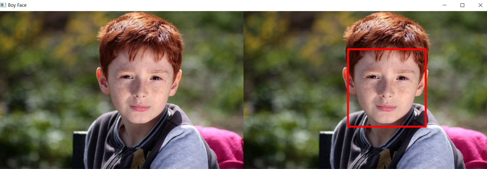
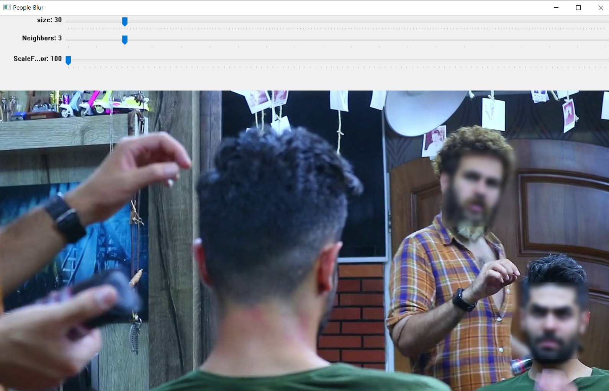
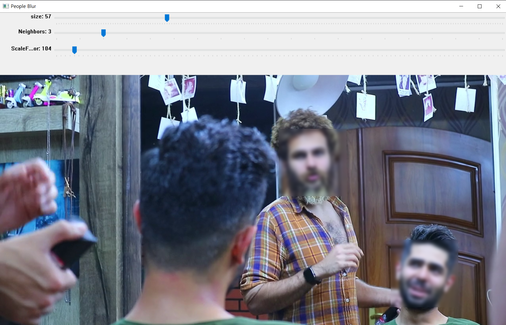

# Face_Blur
sklearn의 KNeighborClassifier를 이용한 사람 얼굴 분류 및 분류된 얼굴 블러처리

# 개요
&nbsp;영상처리프로그래밍의 핵심인 머신러닝을 학습하고 직접 부가적 요소인 블러처리나 트랙바를 지정하여 스스로 학습할 수 있는 계기를 만들자고파 프로그램을 제작하는 계기가 되었습니다.

# Python OpenCV와 haarcascade를 이용한 얼굴분류 프로그램 설명
&nbsp;하르 분류 파일 'haarcascade_frontalface_alt2.xml', 'haarcascade_profileface.xml'을 이용하여 전자인 frontalface 분류 xml파일은 사람의 정면 얼굴을 검출하고 후자파일인 profileface은 얼굴의 옆면을 검출하여 분류한 학습된 파일이다. Python의 OpenCV를 이용하여 유사 하르 파일로 특징을 잡아준다. 그 특징을 이용하여 프로그램은 학습을 하여 사람의 얼굴을 분류하게 된다. 기초적인 머신러닝 프로그램이다.   

&nbsp;위의 두 xml파일을 이용하여 영상 속 사람들의 얼굴을 검출하여 흐릿하게 블러처리하는 프로그램이다.   


### Haar cascade file Link
* https://github.com/opencv/opencv/tree/master/data/haarcascades

## 개발 환경
* Jupyter Lab
* OpenCV `pip3 install opencv-python`
> OpenCV version 4.5.5
* numpy
> NumPy version 1.21.5
* skLearn

# 라이브러리
```python
import cv2
import numpy as np
from sklearn.neighbors import KNeighborClassifier
```

# 실행 요약

> 사진 속 얼굴 분류의 자세한 코드는 [`Boy_Face.ipynb`](https://github.com/mongtons/Face_Blur/blob/main/Boy_Face.ipynb)를 확인하면 된다.

&nbsp;위 사진 속 어린 아이의 얼굴을 잘 분류하였는데, 이 분류기는 'haarcascade_frontalface_alt2.xml'를 이용하여 classifier 특징 분류기를 생성하여 실행하였다. 분류기를 생성하기 위해 아래 코드를 보면
```python
classifier=cv2.CascadeClassifier(filename)
```
>filename: `'./파일주소/XML파일명'`   
>classifier: XML을 기반으로 생성한 분류기 객체


CasecadeClassifier메소드를 이용하여 알맞은 xml파일, 특징 분류 파일을 넣어 Classifier 분류기를 생성해준다.
```python
result=classifier.dectMultiScale(image, scaleFactor=None, minNeighbors=None, minSize=None)
```
>image: 입력할 영상, 배열   
>scaleFactor: 영상 축소 비율   
>minNeighbors: 검출한 이웃 사각형이 일정 개수 이상 검출되어야 최종 영역으로 설정할 사각형의 개수   
>minSize: 최소 객체 크기   
>result: 분류기를 통해 검출된 객체의 끝 좌표값(x, y, w, h)

생성한 classifier 분류기 객체로 객체를 검출하여 result에 저장한다. 그리고 저장된 객체를 사각형을 그려 영상을 출력하면 위 사진 같이 나온다.   
이를 통해 동영상 또한 한 프레임씩 끊어서 객체를 검출할 수 있다.

## 동영상 실행
&nbsp;영상에 영상을 얼마나 축소할지, 사각형 개수와 최소 객체의 크기를 조절할 수 있는 트랙바를 넣어 총 3개의 트랙바 넣었다. 또한 사람 얼굴을 사각형으로 표시하지 않고 모자이크와 비슷하게 처리할 수 있는 블러처리를 해보았다.   
블러처리를 위해 가우시안 블러를 사용했다.
```python
cap=cv2.GaussianBlur(frame[y:(y+h), x:(x+w)], (45, 45), 4.)
```




특히 동영상은 계속 움직이기 때문에 사람의 옆면도 분류할 수 있는 'haarcascade_profileface.xml', 새로운 분류기를 추가하였다.
```python
sideFace_classifier=cv2.CascadeClassifier('./haarcascade/haarcascade_profileface.xml')
```
그리고 각 분류기에서 나온 네 좌표 값을 각각 가우시안 블러에 적용하였다.
```python
 F_face_blur=fontFace_classifier.detectMultiScale(frame, minSize=(size, size), minNeighbors=N, scaleFactor=scaleFactor)
 S_face_blur=sideFace_classifier.detectMultiScale(frame, minSize=(size, size), minNeighbors=N, scaleFactor=scaleFactor)
 for x, y, w, h in F_face_blur:
     cap=cv2.GaussianBlur(frame[y:(y+h), x:(x+w)], (45, 45), 4.)
     frame[y:(y+h), x:(x+w)]=cap
 for x, y, w, h in S_face_blur:
     cap=cv2.GaussianBlur(frame[y:(y+h), x:(x+w)], (45, 45), 4.)
     frame[y:(y+h), x:(x+w)]=cap
 cv2.imshow(winName, frame)
 ```
 
 ## 후기
 &nbsp;분류기가 제대로 분류를 못할 때도 있고, scale와 minSize를 변경하면 전혀 인식을 못할 때도 있다. 딥러닝을 이용한 분류 기능이 더 뛰어난 것은 알고 있지만, 머신러닝 분류를 통해 특징을 어떻게 잡아주어야 하는지, 왜 특징을 잘잡아주어야 하는지를 인지할 수 있는 계기가 되었다.
